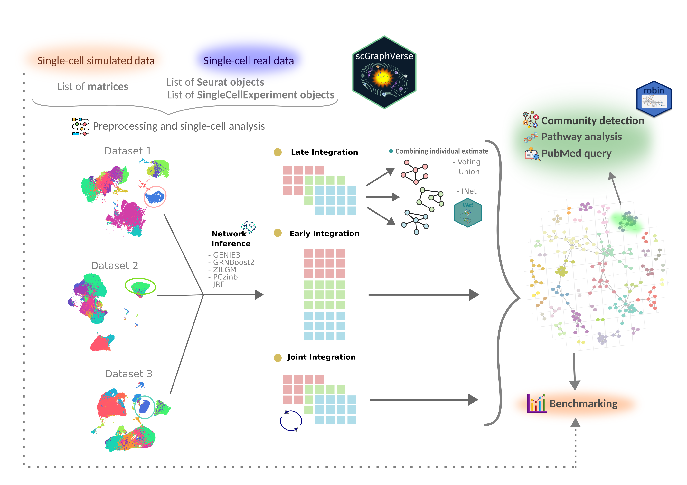

# scGraphVerse

<div align="center">
  
</div>

[](https://www.gnu.org/licenses/gpl-2.0)
[](https://github.com/ngsFC/scGraphVerse/actions)

---

**scGraphVerse** is a comprehensive R package for inferring, evaluating, and visualizing gene regulatory networks (GRNs) from single-cell RNA sequencing data. It provides an integrated framework with multiple inference algorithms, enhanced parameter control, consensus construction, and rich visualizations — all optimized for single-cell expression analysis.

---

## ✨ Key Features
### 🔍 **Multiple GRN Inference Methods**
- **GENIE3** (tree-based ensemble)
- **GRNBoost2** (Python-based gradient boosting)
- **ZILGM** (zero-inflated Gaussian graphical model)
- **PCzinb** (partial correlation with zero-inflated NB model)
- **JRF** (joint random forests)

### 🧠 **Advanced Consensus Methods**
- **Voting consensus** 
- **Union consensus** 
- **INet-tool consensus**
 
### 📊 **Comprehensive Evaluation**
- **Performance metrics**: ROC, AUC, precision, recall, F1-score, MCC
- **Network topology analysis**: modularity, clustering, degree distribution
- **Community detection** with robin package integration
- **Pathway enrichment** analysis (KEGG, Reactome)

### 🧩 **Rich Visualizations**
- **Network plots** with community highlighting
- **ROC curves** and performance dashboards
- **Consensus comparison** visualizations
- **Pathway radar charts** and enrichment plots

---

<div align="center">
  
</div>

---

## 🧪 Installation

### From GitHub (Recommended)

```r
# Install development version
if (!require("devtools")) install.packages("devtools")
devtools::install_github("ngsFC/scGraphVerse")
```

---

---

## 📄 License & Attribution

**scGraphVerse** is licensed under **GPL (>= 2)** .

### Integrated Code Attribution

This package includes adapted functions from:

- **ZILGM** (Park et al., 2021) - GPL-2 license
- **JRF** (Petralia et al., 2015) - GPL (>= 2) license

All integrated code maintains proper attribution and copyright notices.

---

## 📚 Citation

```r
# Get citation information
citation("scGraphVerse")
```

Please also cite the original methods implemented:

1. **GENIE3**: Huynh-Thu et al. (2010). *PLOS ONE* 5(9):e12776
2. **GRNBoost2**: Moerman et al. (2019). *Bioinformatics* 35(12):2159-61
3. **ZILGM**: Park et al. (2021). *Bioinformatics* 37(18):3085-3092
4. **JRF**: Petralia et al. (2015). *Bioinformatics* 31(12):i197-i205
5. **PCzinb**: Nguyen et al. (2023). *Ann. Appl. Stat.* 17(3):2555-73
6. **INet-Tool**: Policastro et al. (2021). *BMC Bioinformatics* 22:1-18

---

## 🆘 Support

- **Documentation**: [https://ngsFC.github.io/scGraphVerse](https://ngsFC.github.io/scGraphVerse)
- **Issues**: [GitHub Issues](https://github.com/ngsFC/scGraphVerse/issues)
- **Discussions**: [GitHub Discussions](https://github.com/ngsFC/scGraphVerse/discussions)

---

## 💰 Funding

This work is supported by the **National Centre for HPC, Big Data and Quantum Computing** 
- **Funded by**: European Union – Next Generation EU – CN00000013 
- **CUP**: B93C22000620006

---

---

<div align="center">
  <p><strong>Happy Network Inference! 🧬📊</strong></p>
</div>
