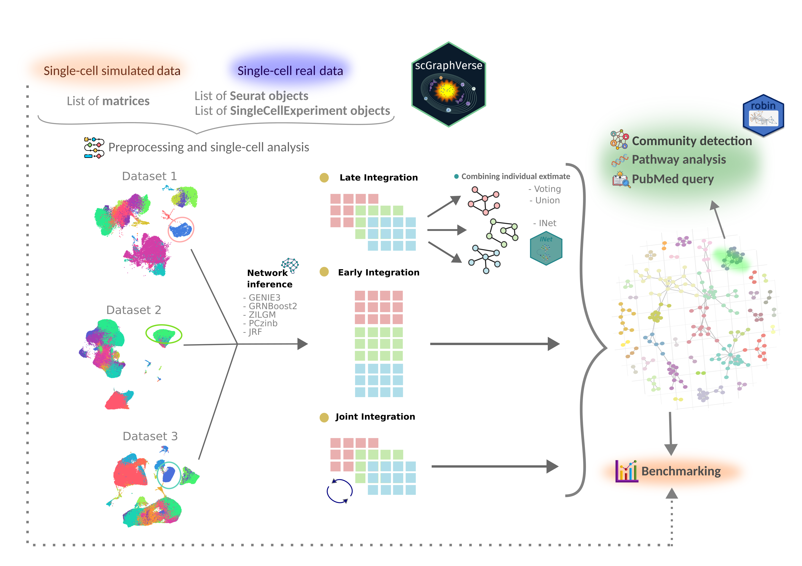

# scGraphVerse 
               
<div align="center">
  
</div>

**scGraphVerse** is an R package for inferring, evaluating, and visualizing gene regulatory networks (GRNs) from single-cell RNA-seq data. It integrates multiple GRN inference methods, customizable thresholding strategies, performance metrics, and consensus network construction — all designed with flexibility, scalability, and visualization in mind.

---

## ✨ Features

- 🔍 Inference of GRNs from count matrices using methods like **GENIE3**, **GRNBoost2**, and **JRF**.
- 🎯 Thresholding of weighted networks using shuffled matrix null models.
- 🧠 Consensus network generation via voting, union, or the **INet** framework.
- 📊 Performance evaluation with ROC curves, classification metrics, and radar plots.
- 🧩 Network visualization with force-directed layouts and `ggraph`.

---

<div align="center">
  
</div>

## 🧬 Installation

This package is not yet on CRAN or Bioconductor. You can install the development version directly from GitHub:

```r
# You need devtools to install from GitHub
install.packages("devtools")
devtools::install_github("ngsFC/scGraphVerse")
```

---
## Abstract BITS 2025

### Title
**scGraphVerse**: A Unified Framework for Network Inference, Evaluation, and Visualization from Single-Cell Gene Expression Data

### Authors
Francesco Cecere, Daniela De Canditiis, Annamaria Carissimo, Claudia Angelini

### Affiliations
Institute of Genetics and Biophysics (IGB) "Adriano Buzzati-Traverso", Consiglio Nazionale delle Ricerche (CNR), Naples, Italy
Istituto per le Applicazioni del Calcolo (IAC) "Mauro Picone", Consiglio Nazionale delle Ricerche (CNR), 80131 Naples, Italy

### Motivation
Gene regulatory network (GRN) inference from single-cell RNA sequencing (scRNA-seq) data is essential for understanding the molecular dynamics of a specific cellular type. However, the diversity of available network inference algorithms and methods and lack of standard evaluation pipelines, in particular for the integration of several experiments, pose challenges for benchmarking and reproducibility. Existing tools often focus on a single task (e.g., inference or visualization), are method-specific, or lack support for modular workflows across different data types and conditions. To address these limitations, we developed scGraphVerse, an R/Bioconductor package that provides a unified and extensible framework for GRN inference, evaluation, consensus building, and visualization from scRNA-seq data.

### Methods
scGraphVerse supports a modular workflow where users can input single or multiple gene expression matrices and apply a variety of inference algorithms. The package allows users to compare network structures generated from early, late, or joint data integration strategies. scGraphVerse includes utilities to compute network similarity, identify consensus edges across runs or methods, and evaluate networks using gold standard interactions. 
Taking common metrics such as TPR, FPR, Precision and others it can evaluate the performance assessment of the methods. scGraphVerse also facilitates downstream analysis such as community detection, pathway analysis and text mining approach to study gene-gene interaction in PubMed. Visualization modules provide publication-ready plots for network structure, ROC curves, and community similarity. All functions are compatible with standard Bioconductor data structures, ensuring interoperability with existing workflows.

### Results
We applied scGraphVerse to benchmark network inference methods across simulated and real single-cell datasets. In simulation, we evaluated performance across varying levels of experiments (1 to 5 matrices), repeated runs (n = 10), and level of integration (late, early and joint integration) using GENIE3, GRNBoost2, and JRF. Using simulated scRNA-seq data we revealed that joint integration often improves robustness and performance. Community detection across inferred networks showed consistent modular structures and supported the recovery of known regulatory modules. The package’s consensus functions enhanced the stability of inferred interactions across multiple runs and methods. Visualization tools allowed intuitive inspection of network topology and evaluation metrics, aiding interpretation and reproducibility. scGraphVerse provides a flexible, comprehensive toolkit for network-centric analysis of scRNA-seq data and enables scalable benchmarking and comparative studies across algorithms and datasets.

### References

### Abstract URL

### Supplemetary info

---
