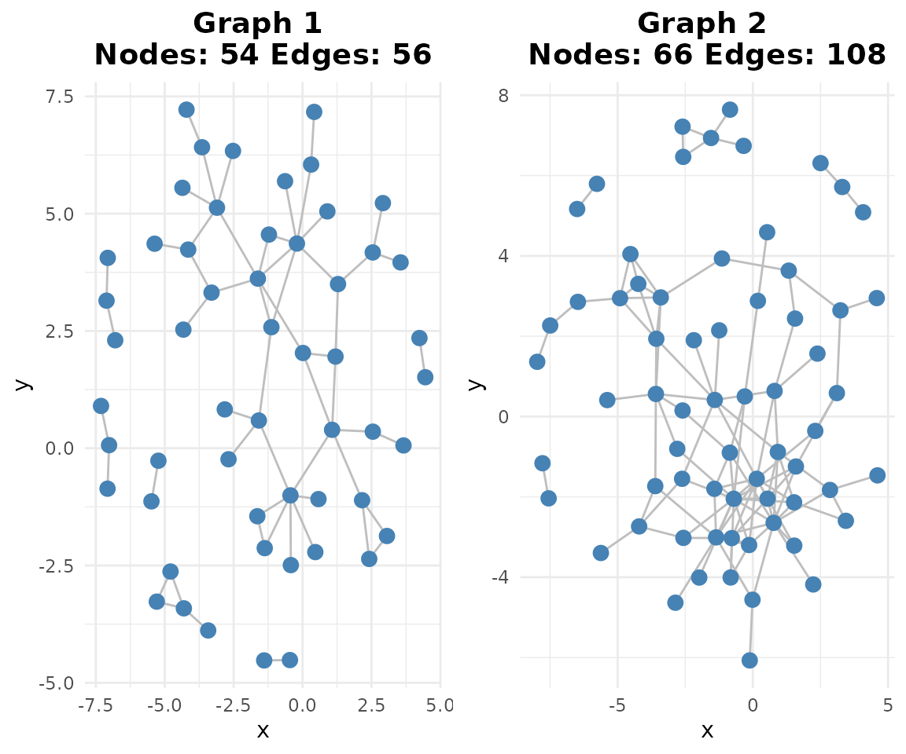
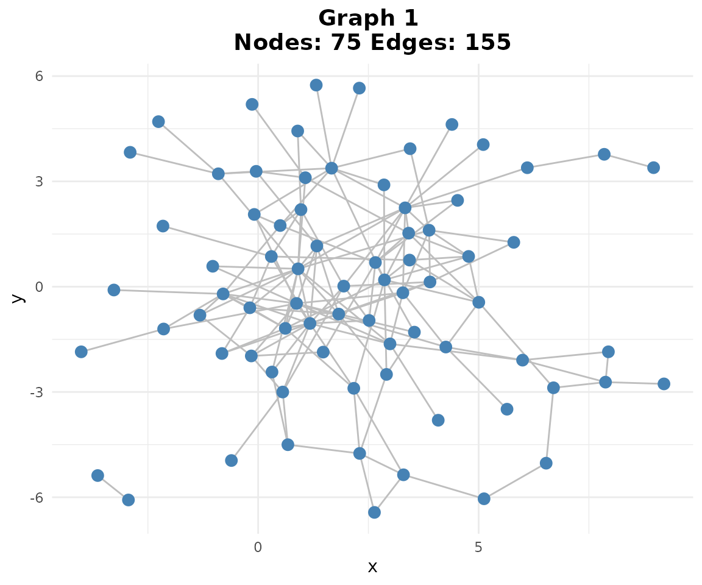

# scGraphVerse Case Study: B-cell GRN Reconstruction

## Introduction

This vignette demonstrates the **scGraphVerse** workflow on a
single-cell RNA-seq dataset. We show how to:

1.  Load and preprocess public PBMC data.
2.  Infer gene regulatory networks with **GENIE3**.
3.  Build consensus networks and detect communities.
4.  Validate inferred edges using STRINGdb.

## 1. Dataset and Preprocessing

In this real-data analysis, we’ll work with two public PBMC (Peripheral
Blood Mononuclear Cell) datasets from 10X Genomics. Our strategy is to
focus specifically on B cells and identify a common set of highly
expressed genes across both datasets. This approach allows us to compare
regulatory networks between different experimental batches while
controlling for cell type and gene selection effects.

**Data Processing Workflow:** 1. Load two PBMC datasets (3k and 4k
cells) from TENxPBMCData 2. Use SingleR for automated cell type
annotation 3. Select top 500 most expressed genes in B cells from each
dataset 4. Find intersection of expressed genes to ensure comparable
gene sets 5. Subset datasets to B cells only with common gene set

This preprocessing ensures we have clean, comparable data for network
inference.

``` r

# Note: This vignette requires external packages from Suggests
# Install if needed:
# BiocManager::install(c("TENxPBMCData", "scater", "SingleR", "celldex"))

# Helper function to preprocess PBMC data
preprocess_pbmc <- function(pbmc_obj) {
    sce <- scater::logNormCounts(pbmc_obj)
    symbols_tenx <- SummarizedExperiment::rowData(sce)$Symbol_TENx
    valid <- !is.na(symbols_tenx) & symbols_tenx != ""
    sce <- sce[valid, ]
    rownames(sce) <- make.unique(symbols_tenx[valid])
    SummarizedExperiment::assay(sce, "logcounts") <-
        as.matrix(SummarizedExperiment::assay(sce, "logcounts"))
    colnames(sce) <- paste0("cell_", seq_len(ncol(sce)))
    return(sce)
}

# 1. Load and preprocess PBMC data
if (requireNamespace("TENxPBMCData", quietly = TRUE)) {
    pbmc_obj <- TENxPBMCData::TENxPBMCData("pbmc3k")
    pbmc_obj1 <- TENxPBMCData::TENxPBMCData("pbmc4k")

    sce <- preprocess_pbmc(pbmc_obj)
    sce1 <- preprocess_pbmc(pbmc_obj1)

    # 2. Cell type annotation
    if (requireNamespace("celldex", quietly = TRUE) &&
        requireNamespace("SingleR", quietly = TRUE)) {
        ref <- celldex::HumanPrimaryCellAtlasData()
        pred1 <- SingleR::SingleR(test = sce1, ref = ref, labels=ref$label.main)
        SummarizedExperiment::colData(sce1)$pcell <- pred1$labels

        pred <- SingleR::SingleR(test = sce, ref = ref, labels=ref$label.main)
        SummarizedExperiment::colData(sce)$pcell <- pred$labels

        # 3. Select top 100 B-cell genes
        genes <- selgene(
            object = sce,
            top_n = 100,
            cell_type = "B_cell",
            cell_type_col = "pcell",
            remove_rib = TRUE,
            remove_mt = TRUE
        )

        genes1 <- selgene(
            object = sce1,
            top_n = 100,
            cell_type = "B_cell",
            cell_type_col = "pcell",
            remove_rib = TRUE,
            remove_mt = TRUE
        )

        # 4. Find intersection
        commong <- intersect(genes, genes1)

        # 5. Subset data
        pbmc1_sub <- sce[
            commong,
            SummarizedExperiment::colData(sce)$pcell == "B_cell"
        ]
        pbmc2_sub <- sce1[
            commong,
            SummarizedExperiment::colData(sce1)$pcell == "B_cell"
        ]

        pbmc1_sub <- pbmc1_sub[, 1:85]
        pbmc2_sub <- pbmc2_sub[, 1:85]

        # Create MultiAssayExperiment for multi-sample analysis
        bcell_mae <- create_mae(list(pbmc1 = pbmc1_sub, pbmc2 = pbmc2_sub))
    }
}
#> see ?TENxPBMCData and browseVignettes('TENxPBMCData') for documentation
#> downloading 1 resources
#> retrieving 1 resource
#> loading from cache
#> see ?TENxPBMCData and browseVignettes('TENxPBMCData') for documentation
#> downloading 1 resources
#> retrieving 1 resource
#> loading from cache
#> Warning in .library_size_factors(assay(x, assay.type), ...): 'librarySizeFactors' is deprecated.
#> Use 'scrapper::centerSizeFactors' instead.
#> See help("Deprecated")
#> Warning in .local(x, ...): 'normalizeCounts' is deprecated.
#> Use 'scrapper::normalizeCounts' instead.
#> See help("Deprecated")
#> Warning in .library_size_factors(assay(x, assay.type), ...): 'librarySizeFactors' is deprecated.
#> Use 'scrapper::centerSizeFactors' instead.
#> See help("Deprecated")
#> Warning in .local(x, ...): 'normalizeCounts' is deprecated.
#> Use 'scrapper::normalizeCounts' instead.
#> See help("Deprecated")
#> Using SCE assay 'logcounts' (log-normalized).
#> Subsetted to 344 cells where pcell = 'B_cell'.
#> Removed mitochondrial genes matching '^MT-'.
#> Removed ribosomal genes matching '^RP[SL]'.
#> Top 100 genes selected based on mean expression.
#> Using SCE assay 'logcounts' (log-normalized).
#> Subsetted to 607 cells where pcell = 'B_cell'.
#> Removed mitochondrial genes matching '^MT-'.
#> Removed ribosomal genes matching '^RP[SL]'.
#> Top 100 genes selected based on mean expression.
```

## 2. Network Inference

Now we’ll infer gene regulatory networks from our preprocessed B cell
data using GENIE3. Unlike the simulation study where we had control over
all parameters, here we’re working with real biological data that
presents unique challenges: B cells have distinct expression patterns,
lower total gene counts compared to the full transcriptome, and batch
effects between the two PBMC datasets.

The function now accepts a `MultiAssayExperiment` object as input, which
provides a structured way to handle multiple experimental conditions.

``` r

# Choose method: "GENIE3", "GRNBoost2", "ZILGM", "PCzinb" or "JRF"
method <- "GENIE3"
if (exists("bcell_mae")) {
    networks <- infer_networks(
        count_matrices_list = bcell_mae,
        method = method,
        nCores = 1
    )
}
```

### 2.1. Building Adjacency Matrices

Here we apply a more stringent threshold (99th percentile) compared to
the simulation study (95th percentile). This is appropriate for real
data analysis where we expect higher noise levels and want to focus on
the most confident regulatory relationships. With B cell data, we’re
particularly interested in high-confidence edges controlling B cell
function.

The functions now return and work with `SummarizedExperiment` objects
for better data organization and metadata tracking.

``` r

if (exists("networks")) {
    # Weighted adjacency (returns SummarizedExperiment)
    wadj_se <- generate_adjacency(networks)

    # Symmetrize (returns SummarizedExperiment)
    swadj_se <- symmetrize(wadj_se, weight_function = "mean")

    # Binary cutoff (top 1%, returns SummarizedExperiment)
    binary_se <- cutoff_adjacency(
        count_matrices = bcell_mae,
        weighted_adjm_list = swadj_se,
        n = 1,
        method = method,
        quantile_threshold = 0.99,
        nCores = 1
    )

    # Plot
    if (requireNamespace("ggraph", quietly = TRUE)) {
        plotg(binary_se)
    }
}
```



## 3. Consensus and Community Detection

With only two PBMC datasets, our consensus network will include edges
that appear in both batches, providing high confidence in the regulatory
relationships.

``` r

if (exists("binary_se")) {
    # Consensus by vote
    consensus <- create_consensus(binary_se, method = "vote")

    # Plot consensus network
    if (requireNamespace("ggraph", quietly = TRUE)) {
        plotg(consensus)
    }
}
```



Here we demonstrate the use of
[`classify_edges()`](https://ngsfc.github.io/scGraphVerse/reference/classify_edges.md)
and
[`plot_network_comparison()`](https://ngsfc.github.io/scGraphVerse/reference/plot_network_comparison.md)
for detailed network comparison analysis. The `false_plot` parameter
controls whether to include false positive/negative plots.

``` r

if (exists("consensus")) {
    # Note: For comparison with external databases like STRINGdb,
    # use stringdb_adjacency() to fetch reference networks

    # Community detection
    if (requireNamespace("igraph", quietly = TRUE)) {
        communities <- community_path(consensus)
    }
}
#> 
#> 
#> Detecting communities...
```


    #> Running pathway enrichment...
    #> 'select()' returned 1:1 mapping between keys and columns
    #> Reading KEGG annotation online: "https://rest.kegg.jp/link/hsa/pathway"...
    #> Reading KEGG annotation online: "https://rest.kegg.jp/list/pathway/hsa"...
    #> 'select()' returned 1:1 mapping between keys and columns
    #> 'select()' returned 1:1 mapping between keys and columns
    #> 'select()' returned 1:1 mapping between keys and columns
    #> 'select()' returned 1:1 mapping between keys and columns
    #> 'select()' returned 1:1 mapping between keys and columns
    #> 'select()' returned 1:1 mapping between keys and columns
    #> 'select()' returned 1:1 mapping between keys and columns
    #> Warning in calculate_qvalue(ora_res$pvalue): qvalue::qvalue() failed, returning
    #> NA for qvalue. Error: missing values and NaN's not allowed if 'na.rm' is FALSE

## 4. Validation with STRINGdb

Unlike the simulation study where we used STRINGdb to create ground
truth, here we use it for validation of our inferred B cell regulatory
network. The `keep_all_genes = TRUE` parameter ensures we retain
information for all genes in our dataset, even those not found in
STRING, which is important for comprehensive edge mining analysis.

``` r

# Note: This requires internet connection for STRINGdb downloads
# This section requires the STRINGdb package from Suggests

# STRING's API can be unreachable from CI runners (rate limiting, firewalls),
# so the live query is wrapped in tryCatch to avoid failing the whole
# pkgdown build when the external service is temporarily unavailable.
if (exists("consensus") && requireNamespace("STRINGdb", quietly = TRUE)) {
    str_result <- tryCatch(
        stringdb_adjacency(
            genes = rownames(consensus),
            species = 9606,
            required_score = 900,
            keep_all_genes = TRUE
        ),
        error = function(e) {
            message("Skipping STRINGdb validation: ", conditionMessage(e))
            NULL
        }
    )

    if (!is.null(str_result)) {
        # Extract binary adjacency and symmetrize
        str_binary <- str_result$binary
        ground_truth_se <- symmetrize(
            build_network_se(list(string_network = str_binary)),
            weight_function = "mean"
        )
        ground_truth <- SummarizedExperiment::assay(ground_truth_se, 1)

        # Edge mining: TP rates (returns list of dataframes)
        em <- edge_mining(
            consensus,
            ground_truth = ground_truth,
            query_edge_types = "TP"
        )

        # Display results
        if (length(em) > 0) {
            print(head(em[[1]]))
        }
    }
}
#> Registered S3 method overwritten by 'gplots':
#>   method         from     
#>   reorder.factor DescTools
#> Initializing STRINGdb...
#> Mapping genes to STRING IDs...
#> Mapped 85 genes to STRING IDs.
#> Retrieving **physical** interactions from STRING API...
#> Found 68 STRING physical interactions.
#> Adjacency matrices constructed successfully.
#>       gene1    gene2 edge_type pubmed_hits
#> 3     ACTG1    ARPC2        TP           1
#> 49    HLA-A    HLA-B        TP        3054
#> 52    HLA-A    HLA-C        TP        1266
#> 53    HLA-B    HLA-C        TP        1275
#> 68 HLA-DPA1 HLA-DPB1        TP         144
#> 78     CD74  HLA-DRA        TP          47
#>                                                                                                                                                                                                                                                                                                                                                                                                                                                                                                                                                                                                                                                                                                                                                                                                                                                                                                                                  PMIDs
#> 3                                                                                                                                                                                                                                                                                                                                                                                                                                                                                                                                                                                                                                                                                                                                                                                                                                                                                                                             34938284
#> 49 42684703,42677276,42661591,42641156,42638165,42636156,42601982,42598440,42525132,42516561,42499444,42476921,42453298,42400301,42396522,42386975,42341485,42313829,42265862,42248265,42242099,42231601,42222623,42219374,42168535,42154610,42153631,42153216,42144646,42141720,42131416,42109632,42095996,42085485,42069060,42053151,42051541,42051172,42039606,42038576,42035896,42018610,42014364,42002301,41995725,41984822,41983543,41947660,41943918,41921040,41905023,41892813,41892014,41883317,41875007,41859107,41846355,41844957,41844718,41839705,41834397,41814487,41811037,41789101,41764741,41763455,41757185,41751595,41746066,41742600,41737233,41721246,41687086,41685425,41644240,41633310,41628351,41614782,41583498,41540446,41535141,41530975,41524197,41503272,41500176,41469502,41469025,41444678,41407397,41399345,41395570,41384865,41325321,41316520,41305516,41301809,41296809,41292245,41284357,41201433
#> 52 42684703,42677276,42661591,42641156,42601982,42568226,42547941,42528172,42525132,42499444,42421796,42409738,42387813,42386975,42369503,42351142,42341485,42313829,42310992,42265862,42222623,42185657,42153631,42153216,42141720,42131416,42095996,42088492,42085485,42069060,42053151,42051172,42039606,41995725,41983543,41980033,41947660,41925081,41925073,41859107,41844718,41814487,41789101,41764741,41763455,41761579,41757185,41751595,41742600,41685425,41671721,41633310,41583498,41530975,41503272,41489282,41469502,41469025,41444678,41407397,41395570,41305516,41292245,41284357,41246448,41201433,41139148,41128369,41121425,41097894,41035653,41011272,41003814,40941618,40912174,40896631,40873549,40842414,40820324,40804474,40791414,40770645,40739281,40721532,40668377,40642077,40637873,40577315,40574847,40535491,40508057,40469303,40429368,40405507,40402323,40390041,40366340,40361234,40284905,40239304
#> 53 42684703,42677276,42663228,42661591,42641156,42601982,42525132,42499444,42447072,42386975,42384312,42341485,42313829,42265862,42222623,42221876,42153631,42153216,42141720,42131416,42095996,42085485,42069060,42053151,42051172,42039606,42012151,41995725,41990286,41983543,41947660,41909928,41859107,41844718,41814487,41807658,41792024,41789101,41764741,41763455,41757185,41751595,41742600,41693977,41685956,41685425,41633310,41583498,41567375,41530975,41522531,41512531,41503272,41469502,41469025,41444678,41407397,41395570,41371300,41369049,41357573,41352458,41317107,41305516,41292245,41284357,41257274,41201433,41139148,41128369,41121425,41104340,41035653,41032234,41011272,41003814,40941618,40896631,40873549,40862422,40820673,40820324,40806754,40791414,40784610,40770645,40749828,40744770,40739281,40721532,40706259,40693714,40668377,40663089,40577315,40574847,40557158,40535491,40508057,40492078
#> 68 42661591,42409602,42398735,42341485,42317364,42173749,42039606,41844718,41622026,41530975,41029168,40900789,40397991,40325173,40200142,40188974,39933824,39881164,39447013,39378468,39329950,39107575,38887889,38840925,38590523,38261568,38226399,37878653,37788895,37452528,36975409,36406135,36111050,35769989,35603163,35592524,35530289,35356004,35321340,35275975,35255603,35105721,34888651,34692653,34484213,34289534,34275915,34209514,34153078,34137173,34096881,33939725,33787425,33736632,33387576,33235138,33012745,32922758,32893027,32574393,32573827,32550246,32547543,32424903,31844174,31345698,31331679,31009447,30881381,30738112,30600606,30527956,30471179,30380364,29937294,29578145,29300980,29191591,29061159,28380482,28332201,28267888,27932151,27795724,27258892,27083422,27080919,27051043,26137963,25863099,25753671,25574827,25410188,25376093,25156210,25109699,25103089,24955785,24897020,24698974
#> 78                                                                                                                                                                                                                                                                                                                                                                                                                                                                                              42547896,42500655,42216392,41884418,41584304,41457226,41444632,41318120,41111459,40993240,40806540,40800081,40717170,40517735,40338916,40226614,40223959,39937308,39865657,39694280,39483471,39280905,38367852,38129488,37150240,36975409,36211422,35845067,35804895,35626874,35378753,35208514,34589742,34137173,33235138,33042148,32305991,32259312,32218455,30365966,29867922,28862321,26500140,26246143,24321376,23127183,15467430
#>    query_status
#> 3    hits_found
#> 49   hits_found
#> 52   hits_found
#> 53   hits_found
#> 68   hits_found
#> 78   hits_found
```

## 5. Conclusion

This case study illustrates how **scGraphVerse** enables end-to-end GRN
reconstruction and validation in single-cell data. Users can swap
inference algorithms, tune thresholds, and incorporate external prior
networks.

## Session Information

``` r

sessionInfo()
#> R version 4.6.1 (2026-06-24)
#> Platform: x86_64-pc-linux-gnu
#> Running under: Ubuntu 24.04.4 LTS
#> 
#> Matrix products: default
#> BLAS:   /usr/lib/x86_64-linux-gnu/openblas-pthread/libblas.so.3 
#> LAPACK: /usr/lib/x86_64-linux-gnu/openblas-pthread/libopenblasp-r0.3.26.so;  LAPACK version 3.12.0
#> 
#> locale:
#>  [1] LC_CTYPE=C.UTF-8       LC_NUMERIC=C           LC_TIME=C.UTF-8       
#>  [4] LC_COLLATE=C.UTF-8     LC_MONETARY=C.UTF-8    LC_MESSAGES=C.UTF-8   
#>  [7] LC_PAPER=C.UTF-8       LC_NAME=C              LC_ADDRESS=C          
#> [10] LC_TELEPHONE=C         LC_MEASUREMENT=C.UTF-8 LC_IDENTIFICATION=C   
#> 
#> time zone: UTC
#> tzcode source: system (glibc)
#> 
#> attached base packages:
#> [1] stats4    stats     graphics  grDevices utils     datasets  methods  
#> [8] base     
#> 
#> other attached packages:
#>  [1] TENxPBMCData_1.30.0         HDF5Array_1.40.0           
#>  [3] h5mread_1.4.1               rhdf5_2.56.0               
#>  [5] DelayedArray_0.38.2         SparseArray_1.12.2         
#>  [7] S4Arrays_1.12.0             abind_1.4-8                
#>  [9] Matrix_1.7-5                SingleCellExperiment_1.34.0
#> [11] SummarizedExperiment_1.42.0 Biobase_2.72.0             
#> [13] GenomicRanges_1.64.0        Seqinfo_1.2.0              
#> [15] IRanges_2.46.0              S4Vectors_0.50.2           
#> [17] BiocGenerics_0.58.1         generics_0.1.4             
#> [19] MatrixGenerics_1.24.0       matrixStats_1.5.0          
#> [21] scGraphVerse_0.99.21        BiocStyle_2.40.0           
#> 
#> loaded via a namespace (and not attached):
#>   [1] gld_2.6.8                   Biostrings_2.80.1          
#>   [3] vctrs_0.7.3                 ggtangle_0.1.2             
#>   [5] perturbR_0.1.3              digest_0.6.39              
#>   [7] png_0.1-9                   shape_1.4.6.1              
#>   [9] proxy_0.4-29                Exact_3.3                  
#>  [11] pcaPP_2.0-5                 BiocBaseUtils_1.14.2       
#>  [13] gypsum_1.8.0                ggrepel_0.9.8              
#>  [15] bst_0.3-24                  hdrcde_3.5.0               
#>  [17] MASS_7.3-65                 fontLiberation_0.1.0       
#>  [19] pkgdown_2.2.1               reshape2_1.4.5             
#>  [21] foreach_1.5.2               qvalue_2.44.0              
#>  [23] withr_3.0.3                 xfun_0.60                  
#>  [25] ggfun_0.2.1                 survival_3.8-6             
#>  [27] doRNG_1.8.6.3               memoise_2.0.1              
#>  [29] ggbeeswarm_0.7.3            clusterProfiler_4.20.0     
#>  [31] gson_0.2.1                  systemfonts_1.3.2          
#>  [33] gtools_3.9.5                ragg_1.5.2                 
#>  [35] tidytree_0.4.8              networkD3_0.4.1            
#>  [37] WeightSVM_1.7-16            KEGGREST_1.52.2            
#>  [39] otel_0.2.0                  httr_1.4.9                 
#>  [41] GENIE3_1.34.0               hash_2.2.6.4               
#>  [43] rhdf5filters_1.24.1         ps_1.9.3                   
#>  [45] rstudioapi_0.19.0           DOSE_4.6.0                 
#>  [47] processx_3.9.0              curl_8.0.0                 
#>  [49] ScaledMatrix_1.20.0         ggraph_2.2.2               
#>  [51] polyclip_1.10-7             ExperimentHub_3.2.2        
#>  [53] stringr_1.6.0               desc_1.4.3                 
#>  [55] pracma_2.4.6                doParallel_1.0.17          
#>  [57] evaluate_1.0.5              BiocFileCache_3.2.0        
#>  [59] hms_1.1.4                   glmnet_5.0                 
#>  [61] bookdown_0.48               irlba_2.3.7                
#>  [63] colorspace_2.1-3            filelock_1.0.3             
#>  [65] reticulate_1.47.0           readxl_1.5.0               
#>  [67] magrittr_2.0.5              readr_2.2.0                
#>  [69] viridis_0.6.5               ggtree_4.2.0               
#>  [71] lattice_0.22-9              XML_3.99-0.24              
#>  [73] scuttle_1.22.0              class_7.3-23               
#>  [75] pillar_1.11.1               nlme_3.1-169               
#>  [77] iterators_1.0.14            caTools_1.18.4             
#>  [79] compiler_4.6.1              beachmat_2.28.0            
#>  [81] stringi_1.8.9               DescTools_0.99.60          
#>  [83] plyr_1.8.9                  mpath_0.4-2.27             
#>  [85] fda_6.3.0                   crayon_1.5.3               
#>  [87] scater_1.40.2               gbm_2.3.1                  
#>  [89] gridGraphics_0.5-1          chron_2.3-63               
#>  [91] haven_2.5.5                 graphlayouts_1.2.5         
#>  [93] org.Hs.eg.db_3.23.1         bit_4.6.0                  
#>  [95] rootSolve_1.8.2.4           dplyr_1.2.1                
#>  [97] codetools_0.2-20            textshaping_1.0.5          
#>  [99] BiocSingular_1.28.0         bslib_0.12.0               
#> [101] e1071_1.7-17                lmom_3.3                   
#> [103] alabaster.ranges_1.12.0     fds_1.9                    
#> [105] MultiAssayExperiment_1.38.0 splines_4.6.1              
#> [107] Rcpp_1.1.2                  tidydr_0.0.6               
#> [109] dbplyr_2.6.0                sparseMatrixStats_1.24.0   
#> [111] cellranger_1.1.0            knitr_1.51                 
#> [113] blob_1.3.0                  BiocVersion_3.23.1         
#> [115] robin_2.0.0                 fs_2.1.0                   
#> [117] DelayedMatrixStats_1.34.0   pscl_1.5.9                 
#> [119] expm_1.0-1                  ggplotify_0.1.3            
#> [121] sqldf_0.4-12                tibble_3.3.1               
#> [123] callr_3.8.0                 tzdb_0.5.0                 
#> [125] tweenr_2.0.3                pkgconfig_2.0.3            
#> [127] tools_4.6.1                 cachem_1.1.0               
#> [129] RSQLite_3.53.3              viridisLite_0.4.3          
#> [131] DBI_1.3.0                   numDeriv_2016.8-1.1        
#> [133] distributions3_0.3.0        celldex_1.22.0             
#> [135] fastmap_1.2.0               rmarkdown_2.32             
#> [137] scales_1.4.0                grid_4.6.1                 
#> [139] AnnotationHub_4.2.2         sass_0.4.10                
#> [141] patchwork_1.3.2             BiocManager_1.30.27        
#> [143] graph_1.90.0                alabaster.schemas_1.12.0   
#> [145] SingleR_2.14.1              rpart_4.1.27               
#> [147] farver_2.1.2                tidygraph_1.3.1            
#> [149] scatterpie_0.2.6            gsubfn_0.7                 
#> [151] yaml_2.3.12                 deSolve_1.42               
#> [153] cli_3.6.6                   purrr_1.2.2                
#> [155] lifecycle_1.0.5             askpass_1.2.1              
#> [157] rainbow_3.8                 mvtnorm_1.4-2              
#> [159] BiocParallel_1.46.0         gtable_0.3.6               
#> [161] parallel_4.6.1              ape_5.8-1                  
#> [163] enrichit_0.2.1              jsonlite_2.0.0             
#> [165] bitops_1.1-0                ggplot2_4.0.3              
#> [167] bit64_4.8.6                 yulab.utils_0.2.5          
#> [169] alabaster.matrix_1.12.0     BiocNeighbors_2.6.0        
#> [171] proto_1.0.0                 aisdk_1.4.12               
#> [173] jquerylib_0.1.4             alabaster.se_1.12.0        
#> [175] GOSemSim_2.38.3             lazyeval_0.2.3             
#> [177] alabaster.base_1.12.1       htmltools_0.5.9            
#> [179] enrichplot_1.32.0           GO.db_3.23.1               
#> [181] rappdirs_0.3.4              data.tree_1.2.0            
#> [183] STRINGdb_2.24.0             glue_1.8.1                 
#> [185] httr2_1.3.0                 XVector_0.52.0             
#> [187] gdtools_0.5.1               RCurl_1.98-1.20            
#> [189] qpdf_1.4.1                  treeio_1.36.1              
#> [191] mclust_6.1.3                ks_1.15.3                  
#> [193] gridExtra_2.3.1             boot_1.3-32                
#> [195] igraph_2.3.3                R6_2.6.1                   
#> [197] gplots_3.3.0                tidyr_1.3.2                
#> [199] fdatest_2.1.1               ggiraph_0.9.6              
#> [201] forcats_1.0.1               labeling_0.4.3             
#> [203] cluster_2.1.8.2             rngtools_1.5.2             
#> [205] Rhdf5lib_2.0.0              aplot_0.3.1                
#> [207] plotrix_3.8-14              tidyselect_1.2.1           
#> [209] vipor_0.4.7                 ggforce_0.5.0              
#> [211] fontBitstreamVera_0.1.1     AnnotationDbi_1.74.0       
#> [213] rsvd_1.0.5                  KernSmooth_2.23-26         
#> [215] S7_0.2.2                    fontquiver_0.2.1           
#> [217] data.table_1.18.6.1         htmlwidgets_1.6.4          
#> [219] RColorBrewer_1.1-3          rlang_1.3.0                
#> [221] rentrez_1.2.4               ggnewscale_0.5.2           
#> [223] beeswarm_0.4.0
```
