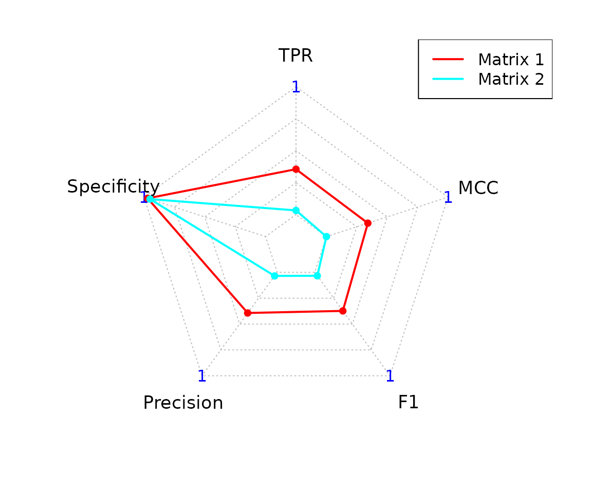
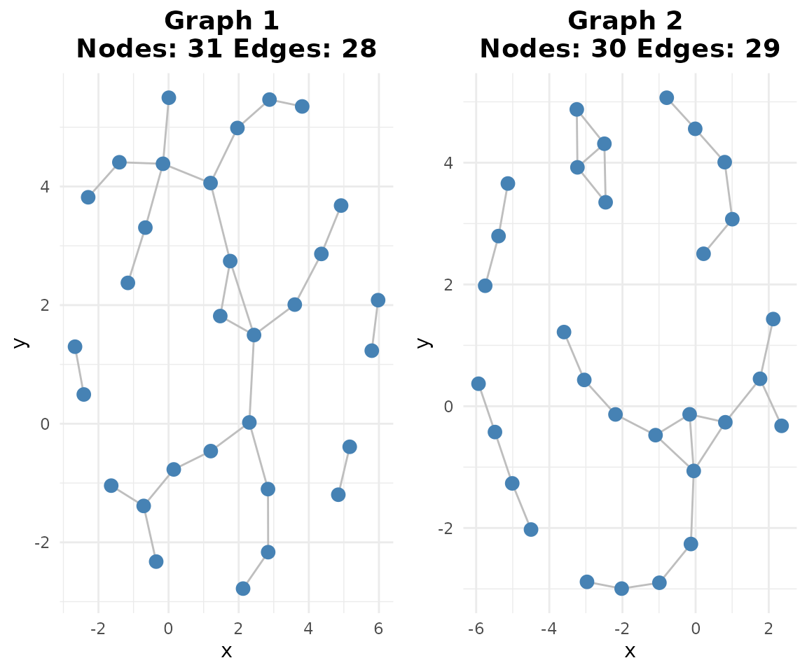
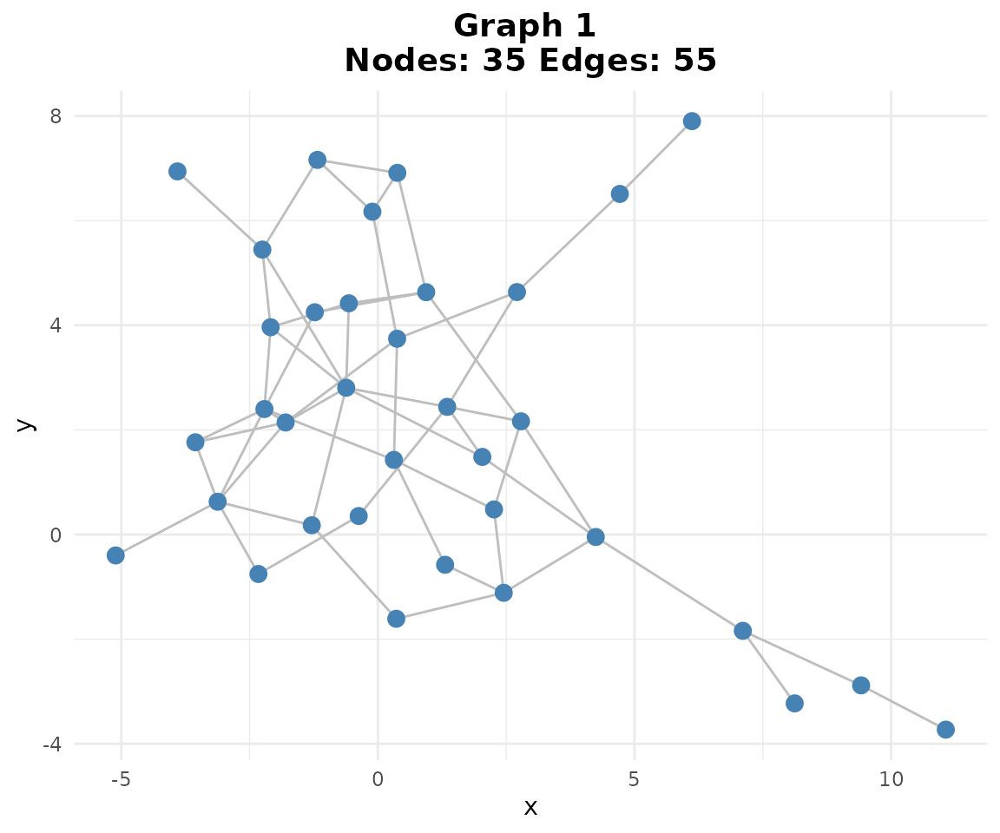

# scGraphVerse Case Study: Zero-Inflated Simulation and GRN Inference

## Introduction

scGraphVerse is a modular and extensible R package for constructing,
comparing, and visualizing gene regulatory networks (GRNs) from
single-cell RNAseq data. It includes several inference algorithms,
utilities, and visualization functions.

Single-cell data presents unique challenges: high sparsity, batch
variation, and the need to distinguish shared versus condition-specific
regulation. scGraphVerse helps address these through multi-method
inference consensus. It starts with SingleCellExperiment, Seurat or
matrix-based objects, enabling flexible pipelines across diverse
experimental setups.

### Why use scGraphVerse?

While several GRN inference packages exist in Bioconductor
(e.g. SCENIC), most are limited to single-method inference or lack
support for multi-condition, multi-replicate, and multi-method
comparisons. scGraphVerse adds value by:

1.  Supporting multiple inference algorithms, including GENIE3,
    GRNBoost2, ZILGM, PCzinb, and Joint Random Forests (JRF).
2.  Providing joint modeling of GRNs across multiple conditions via JRF
3.  Enabling benchmarking simulations from known ground-truth GRNs with
    customizable ZINB-based count matrix generation.
4.  Offering community analysis, including consensus GRNs and databases
    integration (e.g. PubMed and STRINGdb).

### How scGraphVerse works

The typical scGraphVerse workflow begins with one or more count matrix,
or objects like SingleCellExperiment or Seurat. These are passed to the
core function infer_networks(), which runs the selected inference
methods and returns an adjacency matrix or list of matrices.

For benchmarking or teaching purposes, synthetic datasets can be
generated using zinb_simdata() based on a known adjacency matrix. This
supports method comparison across early, late, and joint integration
strategies using earlyj() and compare_consensus().

An end-to-end workflow, from network inference to community detection
and consensus visualization, is provided in the rest of vignettes.

As intended for both high-throughput analysis and intuitive usage,
scGraphVerse supports custom workflows using its modular functions.

## Simulation study

In this simulation study, we use **scGraphVerse** to:

1.  Define a ground-truth regulatory network from high-confidence
    interactions.
2.  Simulate zero-inflated scRNA-seq count data that respects the ground
    truth.
3.  Infer gene regulatory networks using **GENIE3**.
4.  Evaluate performance with ROC curves, precision–recall scores, and
    community similarity.
5.  Build consensus networks and perform edge mining.

## 1. Load Ground-Truth Network

We use a pre-computed toy adjacency matrix (`toy_adj_matrix`) as our
ground truth network. This matrix represents known regulatory
relationships between genes and serves as the reference for evaluating
network inference performance.

``` r

# Load the toy ground truth adjacency matrix
data(toy_adj_matrix)
adj_truth <- toy_adj_matrix

# Visualize network
if (requireNamespace("igraph", quietly = TRUE) &&
    requireNamespace("ggraph", quietly = TRUE)) {
    gtruth <- igraph::graph_from_adjacency_matrix(adj_truth,mode="undirected")
    ggraph::ggraph(gtruth, layout = "fr") +
        ggraph::geom_edge_link(color = "gray") +
        ggraph::geom_node_point(color = "steelblue") +
        ggplot2::ggtitle(paste0(
            "Ground Truth: ",
            igraph::vcount(gtruth),
            " nodes, ",
            igraph::ecount(gtruth),
            " edges"
        )) +
        ggplot2::theme_minimal()
}
```


## 2. Simulating Zero-Inflated Count Data

Now we’ll generate synthetic single-cell count data that respects our
ground-truth network structure. We simulate three experimental
conditions (batches) with 50 cells each, using different parameters to
model realistic batch effects and biological variability. The
[`zinb_simdata()`](https://ngsfc.github.io/scGraphVerse/reference/zinb_simdata.md)
function creates zero-inflated negative binomial count data where gene
expression levels are influenced by the regulatory relationships defined
in our ground-truth network.

**Key simulation parameters:** - `mu_range`: Different mean expression
levels across conditions - `theta`: Overdispersion parameter (lower =
more variable)  
- `pi`: Zero-inflation probability (dropout rate) - `depth_range`:
Sequencing depth variation per cell

``` r

# Simulation parameters
nodes <- nrow(adj_truth)
sims <- zinb_simdata(
    n = 50,
    p = nodes,
    B = adj_truth,
    mu_range = list(c(1, 4), c(1, 7)),
    mu_noise = c(1, 3),
    theta = c(1, 0.7),
    pi = c(0.2, 0.2),
    kmat = 2,
    depth_range = c(0.8 * nodes * 3, 1.2 * nodes * 3)
)
# Transpose to cells × genes
count_matrices <- lapply(sims, t)
```

## 3. Inferring Networks with GENIE3

Next, we apply the **GENIE3** algorithm to infer gene regulatory
networks from our simulated count data. GENIE3 uses random forests to
predict each gene’s expression based on all other genes, then ranks the
importance of potential regulatory relationships. We process all three
batches to capture condition-specific and shared regulatory patterns.

**Note:** The package now uses Bioconductor data structures: -
`count_matrices` is now a `MultiAssayExperiment` (MAE) object - Network
outputs are stored in `SummarizedExperiment` (SE) objects

**GENIE3 workflow:** 1. Create a MAE object from the count matrices list
2. For each target gene, build random forest model using all other genes
as predictors 3. Extract feature importance scores as edge weights 4.
Generate weighted adjacency matrices stored in a SummarizedExperiment 5.
Symmetrize the matrices using mean weights to create undirected networks

``` r

# Create MultiAssayExperiment from count matrices
mae <- create_mae(count_matrices)

# Infer networks
networks_joint <- infer_networks(
    count_matrices_list = mae,
    method = "GENIE3",
    nCores = 1
)

# Generate weighted adjacency matrices (returns SummarizedExperiment)
wadj_se <- generate_adjacency(networks_joint)

# Symmetrize weights (returns SummarizedExperiment)
swadj_se <- symmetrize(wadj_se, weight_function = "mean")
```

## 4. ROC Curve and AUC

Now we evaluate how well our inferred networks recover the ground-truth
regulatory relationships using ROC curve analysis. The ROC curve plots
True Positive Rate (sensitivity) against False Positive Rate
(1-specificity) across different edge weight thresholds. A perfect
classifier would achieve AUC = 1.0, while random guessing gives AUC =
0.5.

**ROC Analysis Steps:** 1. Use continuous edge weights from symmetrized
adjacency matrices 2. Compare against binary ground-truth network 3.
Calculate Area Under Curve (AUC) as overall performance metric 4. Higher
AUC indicates better recovery of true regulatory edges

``` r

if (requireNamespace("pROC", quietly = TRUE)) {
    roc_res <- plotROC(
        swadj_se,
        adj_truth,
        plot_title = "ROC Curve: GENIE3 Network Inference",
        is_binary = FALSE
    )
    roc_res$plot
    auc_joint <- roc_res$auc
}
```

### 4.1. Precision–Recall and Graph Visualization

To convert our continuous edge weights into binary networks, we need to
determine appropriate cutoff thresholds. The
[`cutoff_adjacency()`](https://ngsfc.github.io/scGraphVerse/reference/cutoff_adjacency.md)
function uses a data-driven approach: it creates shuffled versions of
our count data, infers networks from these null datasets, and sets the
threshold at the 95th percentile of shuffled edge weights. This ensures
we keep only edges that are much stronger than expected by random
chance.

**Cutoff Method:** 1. Generate shuffled count matrices (randomize gene
expression profiles) 2. Run GENIE3 on shuffled data to get null
distribution of edge weights 3. Set threshold at 95th percentile of
shuffled weights 4. Apply threshold to original networks to get binary
adjacency matrices 5. Calculate precision metrics: TPR (sensitivity),
FPR, Precision, F1-score

``` r

# Binary cutoff at 95th percentile (returns SummarizedExperiment)
binary_se <- cutoff_adjacency(
    count_matrices = mae,
    weighted_adjm_list = swadj_se,
    n = 1,
    method = "GENIE3",
    quantile_threshold = 0.95,
    nCores = 1,
    debug = TRUE
)
#> [Method: GENIE3] Matrix 1 → Cutoff = 0.06118
#> [Method: GENIE3] Matrix 2 → Cutoff = 0.05981

# Precision scores
pscores_joint <- pscores(adj_truth, binary_se)
#> Negative MCC, set to 0.
#> Registered S3 methods overwritten by 'fmsb':
#>   method    from
#>   print.roc pROC
#>   plot.roc  pROC
```



``` r

head(pscores_joint)
#> $Statistics
#>   Predicted_Matrix TP  TN FP FN        TPR        FPR  Precision         F1
#> 1         Matrix 1 11 547 17 20 0.35483871 0.03014184 0.39285714 0.37288136
#> 2         Matrix 2  1 536 28 30 0.03225806 0.04964539 0.03448276 0.03333333
#>          MCC
#> 1  0.3407438
#> 2 -0.0179451
#> 
#> $Radar
#> $Radar$data
#>                 TPR Specificity  Precision         F1       MCC
#> Max      1.00000000   1.0000000 1.00000000 1.00000000 1.0000000
#> Min      0.00000000   0.0000000 0.00000000 0.00000000 0.0000000
#> Matrix 1 0.35483871   0.9698582 0.39285714 0.37288136 0.3407438
#> Matrix 2 0.03225806   0.9503546 0.03448276 0.03333333 0.0000000
#> 
#> $Radar$plot

# Network plot
if (requireNamespace("ggraph", quietly = TRUE)) {
    plotg(binary_se)
}
```



## 5. Consensus Networks and Community Similarity

Since we have three binary networks (one per experimental condition), we
can create a consensus network that captures edges consistently detected
across conditions. The “vote” method includes an edge in the consensus
only if it appears in at least 2 out of 3 individual networks, making it
more robust to condition-specific noise.

**Consensus Building:** - **Vote method**: Edge included if present in
majority of networks (≥2/3) - **Union method**: Edge included if present
in any network (≥1/3) - **INet method**: Uses weighted evidence
combination (more sophisticated)

``` r

# Consensus matrix (returns SummarizedExperiment)
consensus <- create_consensus(binary_se, method = "vote")

# Plot consensus network
if (requireNamespace("ggraph", quietly = TRUE)) {
    plotg(consensus)
}
```



``` r

# Compare consensus to truth using classify_edges and plot_network_comparison
if (requireNamespace("ggplot2", quietly = TRUE) &&
    requireNamespace("ggraph", quietly = TRUE)) {
    # Wrap toy_adj_matrix in a SummarizedExperiment for classify_edges
    adj_truth_se <- build_network_se(list(ground_truth = adj_truth))

    # classify_edges expects SummarizedExperiment objects
    edge_classification <- classify_edges(
        consensus_matrix = consensus,
        reference_matrix = adj_truth_se
    )

    print(edge_classification)

    # Visualize network comparison (show_fp = FALSE to hide false positives)
    comparison_plot <- plot_network_comparison(
        edge_classification = edge_classification,
        show_fp = FALSE
    )

    print(comparison_plot)
}
#> $tp_edges
#>  [1] "ACTG1-TMSB4X"  "CD3D-CD3E"     "CD74-CXCR4"    "EEF1A1-EEF1D" 
#>  [5] "EEF2-GNB2L1"   "EIF1-EIF3K"    "EIF4A2-PABPC1" "FOS-JUN"      
#>  [9] "FOS-JUNB"      "HLA-B-HLA-E"   "MYL12B-MYL6"  
#> 
#> $fp_edges
#>  [1] "ACTG1-CD74"    "ACTG1-EEF1D"   "ACTG1-JUNB"    "ARPC2-CD3D"   
#>  [5] "ARPC2-UBA52"   "ARPC2-UBC"     "ARPC3-CD3E"    "ARPC3-CXCR4"  
#>  [9] "ARPC3-EEF2"    "ARPC3-MYL6"    "BTF3-CD3D"     "BTF3-COX4I1"  
#> [13] "BTF3-EEF1D"    "BTF3-JUNB"     "BTF3-UBC"      "CD3D-CFL1"    
#> [17] "CD3D-FTL"      "CD3D-MYL12B"   "CD3D-NACA"     "CD3E-MYL12B"  
#> [21] "CFL1-FTL"      "CFL1-HLA-E"    "COX4I1-EEF1D"  "COX4I1-UBC"   
#> [25] "COX7C-EIF3K"   "COX7C-JUNB"    "COX7C-MYL12B"  "CXCR4-TMSB4X" 
#> [29] "CXCR4-UBA52"   "EEF1A1-HLA-E"  "EEF1D-FTL"     "EEF1D-UBC"    
#> [33] "EEF2-PFN1"     "EIF4A2-UBC"    "FOS-HLA-B"     "FTH1-PFN1"    
#> [37] "FTL-NACA"      "HLA-A-UBC"     "HLA-B-JUN"     "HLA-C-NACA"   
#> [41] "HLA-E-MYL6"    "JUN-NACA"      "MYL12B-PABPC1" "MYL6-TMSB4X"  
#> 
#> $fn_edges
#>  [1] "ACTG1-ARPC2"  "ACTG1-ARPC3"  "ACTG1-CFL1"   "ACTG1-MYL6"   "ACTG1-PFN1"  
#>  [6] "ARPC2-ARPC3"  "BTF3-NACA"    "CD3E-HLA-A"   "COX4I1-COX7C" "EEF2-UBA52"  
#> [11] "EIF1-GNB2L1"  "FTH1-FTL"     "GNB2L1-UBA52" "HLA-A-HLA-B"  "HLA-A-HLA-C" 
#> [16] "HLA-A-HLA-E"  "HLA-B-HLA-C"  "HLA-C-HLA-E"  "JUN-JUNB"     "UBA52-UBC"   
#> 
#> $consensus_graph
#> IGRAPH 9eb7346 UN-- 35 55 -- 
#> + attr: name (v/c)
#> + edges from 9eb7346 (vertex names):
#>  [1] ACTG1 --CD74   ACTG1 --EEF1D  ACTG1 --JUNB   ACTG1 --TMSB4X ARPC2 --CD3D  
#>  [6] ARPC2 --UBA52  ARPC2 --UBC    ARPC3 --CD3E   ARPC3 --CXCR4  ARPC3 --EEF2  
#> [11] ARPC3 --MYL6   BTF3  --CD3D   BTF3  --COX4I1 BTF3  --EEF1D  BTF3  --JUNB  
#> [16] BTF3  --UBC    CD3D  --CD3E   CD3D  --CFL1   CD3D  --FTL    CD3D  --MYL12B
#> [21] CD3D  --NACA   CD3E  --MYL12B CD74  --CXCR4  CFL1  --FTL    CFL1  --HLA-E 
#> [26] COX4I1--EEF1D  COX4I1--UBC    COX7C --EIF3K  COX7C --JUNB   COX7C --MYL12B
#> [31] CXCR4 --TMSB4X CXCR4 --UBA52  EEF1A1--EEF1D  EEF1A1--HLA-E  EEF1D --FTL   
#> [36] EEF1D --UBC    EEF2  --GNB2L1 EEF2  --PFN1   EIF1  --EIF3K  EIF4A2--PABPC1
#> + ... omitted several edges
#> 
#> $reference_graph
#> IGRAPH 4187d0b UN-- 35 31 -- 
#> + attr: name (v/c)
#> + edges from 4187d0b (vertex names):
#>  [1] ACTG1 --ARPC2  ACTG1 --ARPC3  ACTG1 --CFL1   ACTG1 --MYL6   ACTG1 --PFN1  
#>  [6] ACTG1 --TMSB4X ARPC2 --ARPC3  BTF3  --NACA   CD3D  --CD3E   CD3E  --HLA-A 
#> [11] CD74  --CXCR4  COX4I1--COX7C  EEF1A1--EEF1D  EEF2  --GNB2L1 EEF2  --UBA52 
#> [16] EIF1  --EIF3K  EIF1  --GNB2L1 EIF4A2--PABPC1 FOS   --JUN    FOS   --JUNB  
#> [21] FTH1  --FTL    GNB2L1--UBA52  HLA-A --HLA-B  HLA-A --HLA-C  HLA-A --HLA-E 
#> [26] HLA-B --HLA-C  HLA-B --HLA-E  HLA-C --HLA-E  JUN   --JUNB   MYL12B--MYL6  
#> [31] UBA52 --UBC   
#> 
#> $edge_colors
#>  [1] "blue" "blue" "blue" "blue" "blue" "red"  "blue" "blue" "red"  "blue"
#> [11] "red"  "blue" "red"  "red"  "blue" "red"  "blue" "red"  "red"  "red" 
#> [21] "blue" "blue" "blue" "blue" "blue" "blue" "red"  "blue" "blue" "red" 
#> [31] "blue"
#> 
#> $use_stringdb
#> [1] FALSE
```


Community detection identifies groups of highly interconnected genes
that likely share biological functions or regulatory mechanisms. We’ll
detect communities in both our inferred consensus network and the
ground-truth network, then compare their similarity using several
metrics.

**Community Detection Steps:** 1. Apply Louvain algorithm to identify
network modules 2. Compare community assignments using multiple
similarity measures: - **Variation of Information (VI)**: Lower values =
more similar - **Normalized Mutual Information (NMI)**: Higher values =
more similar - **Adjusted Rand Index (ARI)**: Higher values = more
similar

Now we’ll detect communities in our ground-truth network to establish
the reference community structure:

``` r

if (requireNamespace("igraph", quietly = TRUE)) {
    comm_truth <- community_path(adj_truth)
}
#> 
#> 
#> Detecting communities...
```


    #> Running pathway enrichment...
    #> 'select()' returned 1:1 mapping between keys and columns
    #> Reading KEGG annotation online: "https://rest.kegg.jp/link/hsa/pathway"...
    #> Reading KEGG annotation online: "https://rest.kegg.jp/list/pathway/hsa"...
    #> 'select()' returned 1:1 mapping between keys and columns
    #> Warning in calculate_qvalue(ora_res$pvalue): qvalue::qvalue() failed, returning
    #> NA for qvalue. Error: missing values and NaN's not allowed if 'na.rm' is FALSE
    #> 'select()' returned 1:1 mapping between keys and columns

``` r

# Detect communities in consensus network
if (requireNamespace("igraph", quietly = TRUE)) {
    comm_cons <- community_path(consensus)
}
#> Detecting communities...
```


    #> Running pathway enrichment...
    #> 'select()' returned 1:1 mapping between keys and columns
    #> 'select()' returned 1:1 mapping between keys and columns
    #> 'select()' returned 1:1 mapping between keys and columns
    #> 'select()' returned 1:1 mapping between keys and columns
    #> 'select()' returned 1:1 mapping between keys and columns

Finally, we’ll quantify how similar the community structures are between
our inferred consensus network and the ground-truth network using the
broken-down functions:

``` r

# Calculate community metrics (VI, NMI, ARI)
if (requireNamespace("igraph", quietly = TRUE)) {
    comm_metrics <- compute_community_metrics(comm_truth, list(comm_cons))
    print(comm_metrics)

    # Calculate topology metrics (modularity, density, etc.)
    # Note: compute_topology_metrics expects community_path outputs
    # Returns a list with $topology_measures and $control_topology
    topo_metrics <- compute_topology_metrics(comm_truth, list(comm_cons))
    print(topo_metrics)

    # Visualize community comparison
    if (requireNamespace("fmsb", quietly = TRUE)) {
        plot_community_comparison(
            community_metrics = comm_metrics,
            topology_measures = topo_metrics$topology_measures,
            control_topology = topo_metrics$control_topology
        )
    }
}
#>                   VI       NMI        ARI
#> Predicted_1 2.171049 0.4432274 0.07116957
#> $topology_measures
#>             Modularity Communities    Density Transitivity
#> Predicted_1  0.4899174           6 0.09243697    0.1538462
#> 
#> $control_topology
#>   Modularity  Communities      Density Transitivity 
#>   0.81373569  10.00000000   0.05210084   0.46666667
```


### 5.1. Edge Mining

Edge mining provides a detailed analysis of network reconstruction
performance by categorizing each predicted edge as True Positive (TP),
False Positive (FP), True Negative (TN), or False Negative (FN). This
gives us insight into which specific regulatory relationships were
successfully recovered. The function now returns a list of dataframes
matching the documentation.

**Edge Mining Analysis:** - **True Positives (TP)**: Correctly predicted
edges that exist in ground truth - **False Positives (FP)**: Incorrectly
predicted edges not in ground truth - **False Negatives (FN)**: Missed
edges that exist in ground truth - **True Negatives (TN)**: Correctly
identified non-edges

``` r

em <- edge_mining(
    consensus,
    ground_truth = adj_truth,
    query_edge_types = "TP"
)
head(em[[1]])
#>     gene1  gene2 edge_type pubmed_hits
#> 7    CD3D   CD3E        TP          61
#> 14   CD74  CXCR4        TP         201
#> 18 EEF1A1  EEF1D        TP           6
#> 21   EIF1  EIF3K        TP           0
#> 26   EEF2 GNB2L1        TP           0
#> 36  HLA-B  HLA-E        TP         103
#>                                                                                                                                                                                                                                                                                                                                                                                                                                                                                                                                                                                                                                                                                                                                                                                                                                                                                                                                  PMIDs
#> 7                                                                                                                                                                                                                                                                                                                                                                      42065189,40969714,40831791,40750862,40725440,40702236,40577225,40394466,39958562,39780208,39493321,39220810,38816839,37942472,37841886,37627776,37571885,37478215,37274867,37113759,37031292,36806614,36291815,36276947,36146529,35720370,35303369,35198572,35090306,34966587,34692491,34108992,33901225,33748188,33688252,33628209,33604380,32509861,32424701,31921117,31842801,30885360,29977931,29920501,29653965,28368009,26459776,25946140,25557485,24748432,21883749,21856934,20478055,16264327,15546002,11261926,7757067,1386345,1981047,2331673,3248386
#> 14 42675914,42656703,42653235,42638932,42634348,42605636,42602048,42511503,42510857,42491877,42486346,42468280,42463025,42459332,42443906,42429909,42364071,42352501,42317343,42305447,42295138,42283835,42254365,42249833,42220555,42129120,42121358,42111497,42064072,42052835,42023218,42022794,42021300,41993933,41987092,41965457,41918097,41840673,41786518,41766668,41766658,41715121,41683916,41679176,41674942,41652980,41634749,41613113,41566509,41558614,41540405,41508023,41502509,41494967,41490945,41436686,41407905,41404455,41391370,41331613,41318120,41234575,41207997,41186525,41127012,40952055,40951943,40948762,40932351,40913267,40831537,40796616,40766141,40740771,40736341,40682854,40575951,40421217,40356050,40342960,40255236,40186663,40066443,40055309,40018995,39915484,39914814,39834330,39712016,39691708,39633216,39502000,39351536,39345457,39323959,39323779,39111632,39084404,39079349,39079345
#> 18                                                                                                                                                                                                                                                                                                                                                                                                                                                                                                                                                                                                                                                                                                                                                                                                                                                                               38173097,35685457,32025546,31639400,30370994,29342219
#> 21                                                                                                                                                                                                                                                                                                                                                                                                                                                                                                                                                                                                                                                                                                                                                                                                                                                                                                                                <NA>
#> 26                                                                                                                                                                                                                                                                                                                                                                                                                                                                                                                                                                                                                                                                                                                                                                                                                                                                                                                                <NA>
#> 36            42598440,42386975,42154537,42018610,41921040,41642982,41411059,41292973,40650195,40074802,39865489,39857739,39853841,39642776,39465562,39158076,38978245,38785545,38390869,38256174,37866940,37638008,37264229,36671730,35806227,35788088,35773466,35596615,35323192,35170024,34676148,34183176,33887202,32421881,32308549,32132995,31375574,30740929,30018803,29453317,29302013,28904123,28340094,27895918,27868107,26658106,25982269,25754738,25700963,25463996,24716975,24709764,24415578,24011128,23986892,23952339,23625662,23021043,22492862,22032294,21209113,21145594,19368562,19005583,17845209,17665395,17430593,16972895,16541432,16538176,16487878,16199130,15386416,15218179,15126407,15069585,14679294,14530885,12806026,12778484,12618909,12175727,11884433,11753519,11575149,10887053,10835481,10403641,10084692,9590243,9583805,9103419,9053439,9021407,8793064,8805247,7897212,8265640,8129848,8462994
#>    query_status
#> 7    hits_found
#> 14   hits_found
#> 18   hits_found
#> 21      no_hits
#> 26      no_hits
#> 36   hits_found
```

``` r

sessionInfo()
#> R version 4.6.1 (2026-06-24)
#> Platform: x86_64-pc-linux-gnu
#> Running under: Ubuntu 24.04.4 LTS
#> 
#> Matrix products: default
#> BLAS:   /usr/lib/x86_64-linux-gnu/openblas-pthread/libblas.so.3 
#> LAPACK: /usr/lib/x86_64-linux-gnu/openblas-pthread/libopenblasp-r0.3.26.so;  LAPACK version 3.12.0
#> 
#> locale:
#>  [1] LC_CTYPE=C.UTF-8       LC_NUMERIC=C           LC_TIME=C.UTF-8       
#>  [4] LC_COLLATE=C.UTF-8     LC_MONETARY=C.UTF-8    LC_MESSAGES=C.UTF-8   
#>  [7] LC_PAPER=C.UTF-8       LC_NAME=C              LC_ADDRESS=C          
#> [10] LC_TELEPHONE=C         LC_MEASUREMENT=C.UTF-8 LC_IDENTIFICATION=C   
#> 
#> time zone: UTC
#> tzcode source: system (glibc)
#> 
#> attached base packages:
#> [1] stats     graphics  grDevices utils     datasets  methods   base     
#> 
#> other attached packages:
#> [1] scGraphVerse_0.99.21 BiocStyle_2.40.0    
#> 
#> loaded via a namespace (and not attached):
#>   [1] fs_2.1.0                    matrixStats_1.5.0          
#>   [3] bitops_1.1-0                enrichplot_1.32.0          
#>   [5] httr_1.4.9                  RColorBrewer_1.1-3         
#>   [7] doParallel_1.0.17           numDeriv_2016.8-1.1        
#>   [9] tools_4.6.1                 doRNG_1.8.6.3              
#>  [11] R6_2.6.1                    lazyeval_0.2.3             
#>  [13] withr_3.0.3                 gridExtra_2.3.1            
#>  [15] cli_3.6.6                   Biobase_2.72.0             
#>  [17] textshaping_1.0.5           scatterpie_0.2.6           
#>  [19] labeling_0.4.3              sass_0.4.10                
#>  [21] mvtnorm_1.4-2               S7_0.2.2                   
#>  [23] readr_2.2.0                 proxy_0.4-29               
#>  [25] askpass_1.2.1               pkgdown_2.2.1              
#>  [27] WeightSVM_1.7-16            systemfonts_1.3.2          
#>  [29] yulab.utils_0.2.5           gson_0.2.1                 
#>  [31] DOSE_4.6.0                  rentrez_1.2.4              
#>  [33] pscl_1.5.9                  readxl_1.5.0               
#>  [35] rstudioapi_0.19.0           RSQLite_3.53.3             
#>  [37] generics_0.1.4              gridGraphics_0.5-1         
#>  [39] shape_1.4.6.1               dplyr_1.2.1                
#>  [41] GO.db_3.23.1                Matrix_1.7-5               
#>  [43] DescTools_0.99.60           S4Vectors_0.50.2           
#>  [45] abind_1.4-8                 lifecycle_1.0.5            
#>  [47] yaml_2.3.12                 SummarizedExperiment_1.42.0
#>  [49] qvalue_2.44.0               SparseArray_1.12.2         
#>  [51] grid_4.6.1                  blob_1.3.0                 
#>  [53] crayon_1.5.3                ggtangle_0.1.2             
#>  [55] lattice_0.22-9              haven_2.5.5                
#>  [57] KEGGREST_1.52.2             pillar_1.11.1              
#>  [59] knitr_1.51                  GenomicRanges_1.64.0       
#>  [61] gld_2.6.8                   boot_1.3-32                
#>  [63] fda_6.3.0                   codetools_0.2-20           
#>  [65] glue_1.8.1                  ggiraph_0.9.6              
#>  [67] ggfun_0.2.1                 fontLiberation_0.1.0       
#>  [69] qpdf_1.4.1                  data.table_1.18.6.1        
#>  [71] fmsb_0.7.6                  MultiAssayExperiment_1.38.0
#>  [73] vctrs_0.7.3                 png_0.1-9                  
#>  [75] treeio_1.36.1               cellranger_1.1.0           
#>  [77] bst_0.3-24                  gtable_0.3.6               
#>  [79] cachem_1.1.0                ks_1.15.3                  
#>  [81] perturbR_0.1.3              xfun_0.60                  
#>  [83] S4Arrays_1.12.0             tidygraph_1.3.1            
#>  [85] fds_1.9                     Seqinfo_1.2.0              
#>  [87] pracma_2.4.6                pcaPP_2.0-5                
#>  [89] survival_3.8-6              aisdk_1.4.12               
#>  [91] SingleCellExperiment_1.34.0 iterators_1.0.14           
#>  [93] nlme_3.1-169                ggtree_4.2.0               
#>  [95] bit64_4.8.6                 fontquiver_0.2.1           
#>  [97] GENIE3_1.34.0               data.tree_1.2.0            
#>  [99] bslib_0.12.0                KernSmooth_2.23-26         
#> [101] otel_0.2.0                  rpart_4.1.27               
#> [103] colorspace_2.1-3            BiocGenerics_0.58.1        
#> [105] DBI_1.3.0                   gbm_2.3.1                  
#> [107] Exact_3.3                   tidyselect_1.2.1           
#> [109] processx_3.9.0              bit_4.6.0                  
#> [111] mpath_0.4-2.27              compiler_4.6.1             
#> [113] glmnet_5.0                  httr2_1.3.0                
#> [115] graph_1.90.0                expm_1.0-1                 
#> [117] desc_1.4.3                  fontBitstreamVera_0.1.1    
#> [119] DelayedArray_0.38.2         bookdown_0.48              
#> [121] scales_1.4.0                callr_3.8.0                
#> [123] rappdirs_0.3.4              stringr_1.6.0              
#> [125] digest_0.6.39               rainbow_3.8                
#> [127] rmarkdown_2.32              XVector_0.52.0             
#> [129] htmltools_0.5.9             pkgconfig_2.0.3            
#> [131] MatrixGenerics_1.24.0       fastmap_1.2.0              
#> [133] rlang_1.3.0                 htmlwidgets_1.6.4          
#> [135] farver_2.1.2                jquerylib_0.1.4            
#> [137] jsonlite_2.0.0              BiocParallel_1.46.0        
#> [139] mclust_6.1.3                GOSemSim_2.38.3            
#> [141] RCurl_1.98-1.20             magrittr_2.0.5             
#> [143] ggplotify_0.1.3             fdatest_2.1.1              
#> [145] patchwork_1.3.2             Rcpp_1.1.2                 
#> [147] ape_5.8-1                   ggnewscale_0.5.2           
#> [149] viridis_0.6.5               gdtools_0.5.1              
#> [151] reticulate_1.47.0           stringi_1.8.9              
#> [153] pROC_1.19.1                 ggraph_2.2.2               
#> [155] rootSolve_1.8.2.4           distributions3_0.3.0       
#> [157] MASS_7.3-65                 plyr_1.8.9                 
#> [159] org.Hs.eg.db_3.23.1         parallel_4.6.1             
#> [161] ggrepel_0.9.8               forcats_1.0.1              
#> [163] lmom_3.3                    Biostrings_2.80.1          
#> [165] graphlayouts_1.2.5          splines_4.6.1              
#> [167] hms_1.1.4                   ps_1.9.3                   
#> [169] igraph_2.3.3                enrichit_0.2.1             
#> [171] rngtools_1.5.2              reshape2_1.4.5             
#> [173] stats4_4.6.1                XML_3.99-0.24              
#> [175] evaluate_1.0.5              BiocManager_1.30.27        
#> [177] deSolve_1.42                tzdb_0.5.0                 
#> [179] foreach_1.5.2               tweenr_2.0.3               
#> [181] networkD3_0.4.1             tidyr_1.3.2                
#> [183] purrr_1.2.2                 polyclip_1.10-7            
#> [185] ggplot2_4.0.3               BiocBaseUtils_1.14.2       
#> [187] ggforce_0.5.0               e1071_1.7-17               
#> [189] tidytree_0.4.8              tidydr_0.0.6               
#> [191] class_7.3-23                viridisLite_0.4.3          
#> [193] ragg_1.5.2                  tibble_3.3.1               
#> [195] clusterProfiler_4.20.0      aplot_0.3.1                
#> [197] memoise_2.0.1               AnnotationDbi_1.74.0       
#> [199] IRanges_2.46.0              cluster_2.1.8.2            
#> [201] robin_2.0.0                 hdrcde_3.5.0
```
