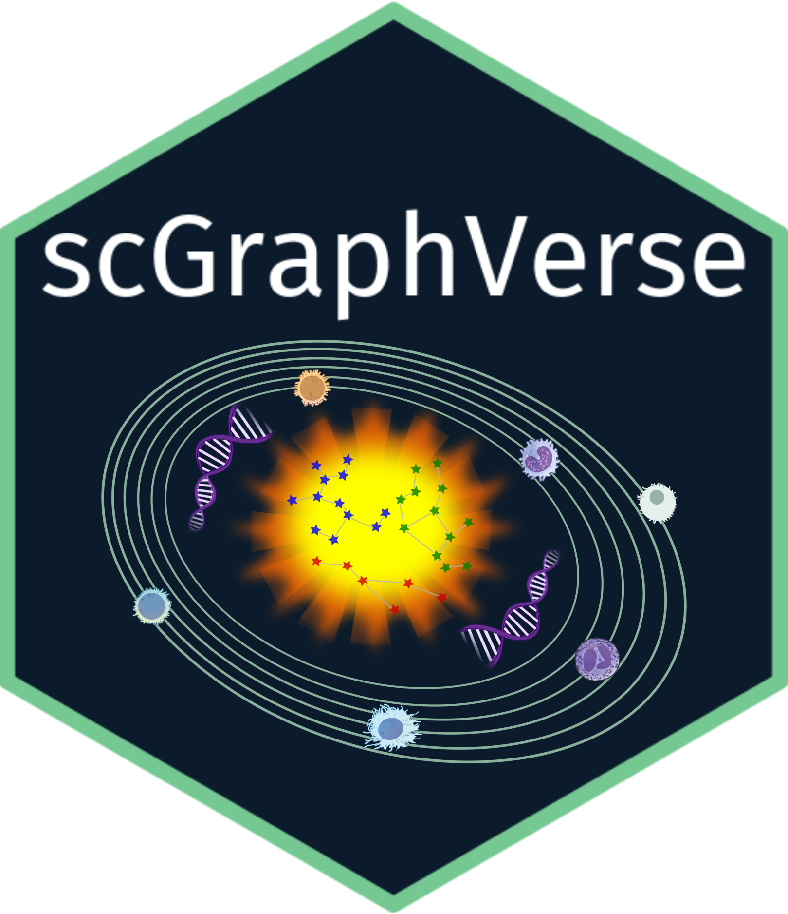

# scGraphVerse



# 🧬 scGraphVerse

### ✨ Comprehensive Gene Regulatory Network Analysis for Single-Cell Data ✨

[](https://www.gnu.org/licenses/gpl-3.0)

------------------------------------------------------------------------

## 🎯 Overview

> **scGraphVerse** is a comprehensive R package for inferring,
> evaluating, and visualizing gene networks from single-cell RNA
> sequencing data. It provides an integrated framework with multiple
> inference algorithms, consensus construction, and rich visualizations
> optimized for single-cell expression analysis.

### ⚡ Key Features

| Feature | Description |
|----|----|
| 🔬 **Multiple Inference Methods** | GENIE3, GRNBoost2, ZILGM, JRF, PCzinb |
| 🤝 **Consensus Networks** | Voting, union, INet integration |
| 📊 **Comprehensive Evaluation** | ROC curves, AUC, F1-score, community analysis |
| 🎨 **Visualizations** | Interactive networks, performance plots |
| 🔧 **Flexible Integration** | SingleCellExperiment, Seurat, matrix objects |

## 🚀 Installation

### 💻 Bioconductor release 3.22

``` r

if (!require("BiocManager", quietly = TRUE))
    install.packages("BiocManager")

BiocManager::install("scGraphVerse")
```

### 🔬 Inference Algorithms

| Method           | Description                             |
|------------------|-----------------------------------------|
| **GENIE3** 🌳    | Tree-based ensemble learning            |
| **GRNBoost2** 🚀 | Gradient boosting with Dask             |
| **ZILGM** 🎯     | Zero-inflated Gaussian graphical models |
| **JRF** 🌲       | Joint Random Forests                    |
| **PCzinb** 🔗    | Partial correlation with ZINB           |

### 🎪 Quick Start Demo

``` r

# Load example data 📊
data("toy_counts")

# Infer networks 🧠
networks <- infer_networks(
  count_matrices_list = toy_counts,
  method = "GENIE3",
  nCores = 1
)

wadj <- generate_adjacency(networks)
wadj <- symmetrize(wadj, weight_function = "mean", nCores = 1)

# Network cutoff 
adj <- cutoff_adjacency(
  toy_counts,
  wadj,
  n = 2,
  method = "GENIE3",
  quantile_threshold = 0.99,
  nCores = 1
)

# Visualize the graphs ✨
plotg(adj)

# Create consensus ✨
consensus <- create_consensus(adj, method = "union")

# Visualize the consensus! 🎨
plotg(consensus)
```

## 📚 Documentation

| Resource | Link | Description |
|----|----|----|
| 🌐 **Website** | [ngsfc.github.io/scGraphVerse](https://ngsfc.github.io/scGraphVerse/) | Main documentation hub |
| 📖 **Simulation Study** | [Vignette](https://ngsfc.github.io/scGraphVerse/articles/simulation_study.html) | Benchmarking tutorial |
| 🔬 **Case Study** | [Vignette](https://ngsfc.github.io/scGraphVerse/articles/case_study.html) | Real-world example |
| 📋 **Reference** | [Manual](https://ngsfc.github.io/scGraphVerse/reference/) | Function documentation |

## 📝 Citation

``` r

citation("scGraphVerse")  # 🎓 Academic credit
```

### 🌟 Please also cite the original methods:

| Method | Citation | Journal |
|----|----|----|
| **GENIE3** 🌳 | Huynh-Thu et al. (2010) | *PLOS ONE* 5(9):e12776 |
| **GRNBoost2** 🚀 | Moerman et al. (2019) | *Bioinformatics* 35(12):2159-61 |
| **ZILGM** 🎯 | Park et al. (2021) | *Statistical Analysis and Data Mining* 37(18):3085-3092 |
| **JRF** 🌲 | Petralia et al. (2015) | *Journal of Proteome Research* 31(12):i197-i205 |
| **PCzinb** 🔗 | Nguyen et al. (2023) | *Ann. Appl. Stat.* 17(3):2555-73 |
| **INet-Tool** 🔧 | Policastro et al. (2025) | *Comput Stat* 40, 1517–1539 |
| **Robin** 🎯 | Policastro et al. (2021) | *The R Journal* 13(1):292-309 |

## ⚖️ License

**scGraphVerse** is licensed under **GPL (≥ 2)** 📜

### 🤝 Integrated Code Attribution

This package includes adapted functions from: - **ZILGM** (Park et al.,
2021) - GPL-2 license - **JRF** (Petralia et al., 2015) - GPL (≥ 2)
license - **learn2count** (Nguyen et al. 2023) - for the PCzinb
implementation

All integrated code maintains proper attribution and copyright notices.

## 💰 Funding

This work is supported by the **National Centre for HPC, Big Data and
Quantum Computing** 🇪🇺 - **Funded by**: European Union – Next Generation
EU – CN00000013 - **CUP**: B93C22000620006

------------------------------------------------------------------------

## 🧬 Happy Network Inference! 📊

*Discover the hidden connections in your single-cell data*
